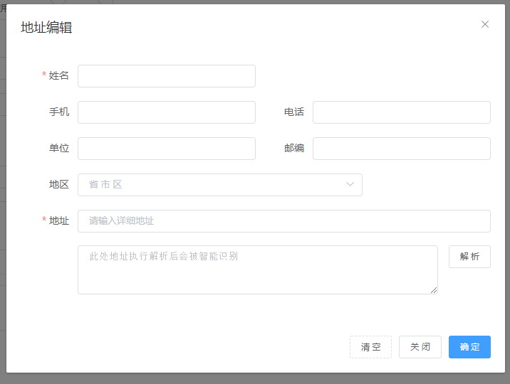

# element-address
基于 [address-parse](https://github.com/akebe/address-parse) 通过 [element-ui](https://github.com/ElemeFE/element) 实现的即开即用地址类组件库

### Install
````
npm install element-address --save
````

### 使用
````
import ElementAddress from 'element-address';

Vue.use(ElementAddress);
````
组件库依赖 [element-ui](https://github.com/ElemeFE/element) 的  
`<el-dialog> <el-button> <el-form> <el-form-item> <el-row> <el-col> <el-input> <el-collapse> <el-collapse-item><el-radio-group> <el-radio> <el-cascader> `  
如按需加载，请确保以上组件已注册

#### 提供3个组件  
`ElAreaCascader`   地址地区级联选择器  
`ElAddressForm`    通用地址解析表单组件   
`ElAddressDialog`  弹层地址解析表单组件 【建议直接使用ElementAddress.$dialog】  
#### 一个方法
`ElementAddress.$dialog` 弹出式地址解析编辑组件

### ElAreaCascader
地址地区级联选择器

#### Attributes
| 参数 | 说明 | 类型 | 可选值 | 默认值 |
| --- | ---- | --- | ---- | ----- |
| size | 表单尺寸 | String | 	medium / small / mini | -- |
| value / v-model | 绑定值 6位地区编码  |String / Number | |--|
| clearable | 是否支持清空选项 | Boolean | -- | true |
| filterable | 是否可搜索选项 | Boolean | -- | true |
| radioHide | 是否隐藏el-cascader单选框 | Boolean | -- | true|
| placeholder | 输入框占位文本 | String | -- | --|
| disabled | 是否禁用 | Boolean | -- | false|
| separator | 选项分隔符 | String | -- | 斜杠' / ' |
| props | 配置选项[参见](https://element.eleme.cn/#/zh-CN/component/cascader#props) | Object | -- | {"checkStrictly":true,"expandTrigger":"hover"} | 

#### Events
| 事件名称 | 说明 | 回调参数 |
| --- | ---- | --- | 
| change | 当选中地区变化触发 | (code 地区地区编码, ary 选中地区数据列表 , codes 选中地区码表 ) | 
 

### ElAddressForm  
带解析功能地址表单  

#### Attributes  
| 参数 | 说明 | 类型 | 可选值 | 默认值 |
| --- | ---- | --- | ---- | ----- |
| size | 表单尺寸 | String | 	medium / small / mini | -- |
| label-width | 表单域标签的的宽度 | String | -- | 80px |
| labels | 标签文本配置项 | Object | -- | {"name":"姓名","mobile":"手机","phone":"电话","code":"地区","details":"地址","company":"单位","zip_code":"邮编","parse":"解 析"} |
| area-props | 地区级联组件配置项| Object | -- | -- |
| placeholders | 占位文本配置项 | Object | -- | {"name":"","mobile":"","phone":"","details":"","company":"","zip_code":"","code":"省 市 区","parse":"此处地址执行解析后会被智能识别"} |
| data | 绑定表单对象 | Object | -- | {"name":"","mobile":"","phone":"","code":"","details":"","company":"","zip_code":"","province":"","city":"","area":""} |
| rules | 表单验证对象 | Object | -- | -- |
| rules-mobile-either | 是否启用mobile跟phone二选一规则 | Boolean | -- | false |
| assigned-before | 表单解析值赋值回调 | Function | -- | -- |
| parse-select | 是否允许解析多结果选择 | Boolean | -- | true |
#### Methods
| 方法名 | 说明 | 参数 |
| --- | ---- | --- | 
| validate | 对整个表单进行校验的方法 | Function(callback: Function(boolean, object)) | 
| clearValidate | 移除表单项的校验结果 | Function(props: array | string) | 
| clear | 清空数据内容并移除表单项的校验结果 | Function() | 
#### Events
| 事件名称 | 说明 | 回调参数 |
| --- | ---- | --- | 
| parse | 地址解析后触发 | (ary 解析结果列表 ) | 
 
### ElementAddress.$dialog
弹层地址表单组件

组件式调用使用唯一入口`this.$refs.dialog.open(options)`  
与全局调用配置一致`ElementAddress.$dialog(options)`
#### Options
支持所有`ElAddressForm`的`Attributes`

| 参数 | 说明 | 类型 | 可选值 | 默认值 |
| --- | ---- | --- | ---- | ----- |
| title | 弹层标题 | String | -- | '地址编辑' |
| cancelButtonText | 取消按钮文本 | String | -- | '取 消' |
| confirmButtonText | 确定按钮文本 | String | -- | '确 定' |
| beforeResolve | 确认前回调 | Function | -- | (data, done) 需要触发done才正式关闭 done(false) 终止 |
| beforeClose | 关闭前回调 | Function | -- | (data, done) 需要触发done才正式关闭 |
| width | 弹层宽度 | String | -- | '700px' |
| closeOnClickModal | 是否点击遮罩关闭 | Boolean | -- | false |

### LICENSE
[MIT](https://en.wikipedia.org/wiki/MIT_License)